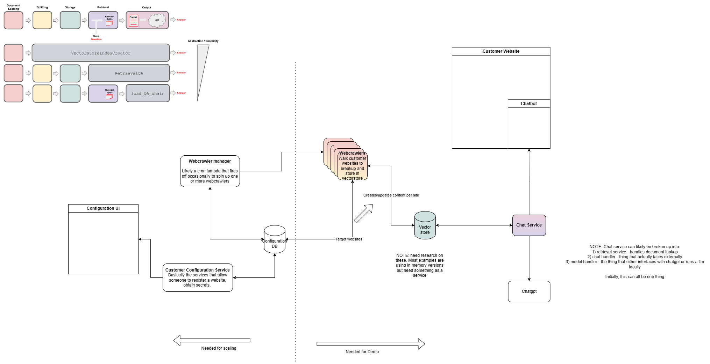

# Gov Chat

A simple chatbot for answering questions about a website's content.

## Objectives

- Provide a deployable service 
- Configurable for either chatgpt or a privately hosted LLM
- Provide a local test harness

## Install LLM

Pick a model from the list [here](https://gpt4all.io/index.html)

Create a folder "models" and place the LLM there. Currently, only tested with `ggml-gpt4all-j-v1.3-groovy.bin`

## Demo/Test Setup

- Install [docker compose] (https://docs.docker.com/compose/install/)
- Install make if you don't already have it

For the first install, you'll need to do a bit of bootstrapping

Spin up postgres

`docker compose up database`

In a new terminal

`make create_db`

`make bootstrap_admin`

Follow the prompts for creating your admin user

That's it! You can close/kill the other terminals an in a new one (or one of the open ones) run
`docker compose up`

You'll now have a couple of "Sites" that you can reach 

http://localhost:8888/admin/ is your customer management dashboard

http://localhost:8080/ is an example js project for a chatbot. (This won't work yet without a scanned website)

It is recommended that you start by creating a customer and associating a site with it through the dashboard. Once you've saved the customer and at least one site, run the following command to kick off the mapping job

`make map_and_index`

This is essentially running the same job that we'd tie to a timer or fire off on specific events. It will first walk all sites to generate sitemaps (assuming one wasn't provided or doesn't need to be updated). It will then index (scan contents, breakup and store) all the sites. There is some logic in the db to prevent us from scanning a particular site more than once a day currently. So you can rerun this as you add more sites. This has been having trouble with Windows. Alternatively, there is a service defined in the docker-compose that will do this job on startup or by runn `docker compose up scan_job`

## Dev Setup 

The project is based in python and is managed by poetry. 

Install python 3.10 according to your operating system and following the instructions here for installing poetry [here](https://python-poetry.org/docs/)

Once you have python and poetry installed, you should be able to run `poetry install` at the root of the repo and all dependencies will be grabbed. 

## Running Test GUI

running the command `python ./test_gui/app.py` will spin up a service listening at http://127.0.0.1:7860. Click on the link or copy/paste into your browser

## Current repo state

|-- customer_management - primary logic and models around individual customers and their respective chatbots. Used primarily by django, but models and access mechanisms are used by some thigns in gov_chat
|-- /frontend - teststub for js client and example implementation for a user facing chatbot
|-- /gov_chat - broken out funcitonal components for all work around the actual chatbot and lifecycle therein
|-- /gov_chat_management - base thing of django project
|-- /test_gui - gradio project for testing that the individual steps in gov_chat worked in the proof of concept

## Architecture

## TODO 

 - [x] create dockerfile for management
 - [x] update docker-compose to spin up django for management
 - [x] create dockerfiles for primary functions (eg sitemap-gen, site-indexing)
 - [x] migrate chat service to fastapi
 - [ ] configure chatserver to use more info from management service and api